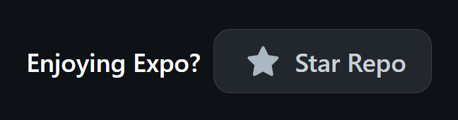

# rust-tour

## Intro
This is my Rust playground follow by the list 👇

https://www.youtube.com/watch?v=OX9HJsJUDxA&list=PLai5B987bZ9CoVR-QEIN9foz4QCJ0H2Y8&index=1

## Playlist
### Video #1
<b> ULTIMATE Rust Lang Tutorial! - Getting Started <b/>

[Video 1](./getting-started/README.md)

### Video #2
<b> Programming a Guessing Game in Rust! <b/>

[Video 2](./guessing-game/README.md)

### Video #3
<b> Common Programming Concepts in Rust <b/>

[Video 3](./common-things/README.md)

### Video #4
<b> Understanding Ownership in Rust <b/>

[Video 4](./ownership/README.md)

### Video #5
<b> Structs in Rust <b/>

[Video 5](./rust-struct/README.md)

### Video #6
<b> Enums and Pattern Matching in Rust <b/>

[Video 6](./rust-enum/README.md)

## Author

This repo was developed by [@lamha](https://github.com/HaLamUs). 
Follow or connect with me on [my LinkedIn](https://www.linkedin.com/in/lamhacs). 

## License
The source code for the site is licensed under the MIT license, [MIT](https://opensource.org/license/mit/)

