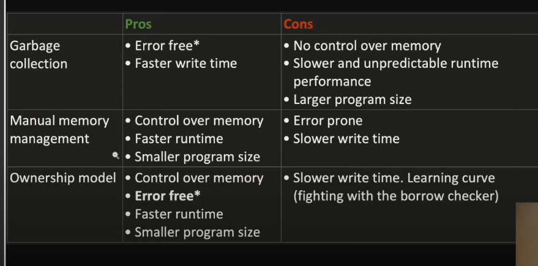
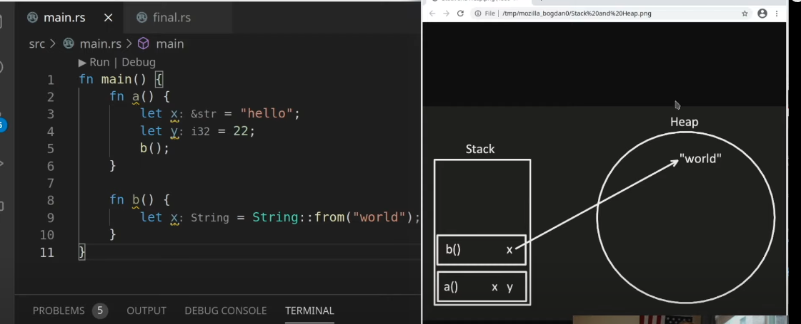
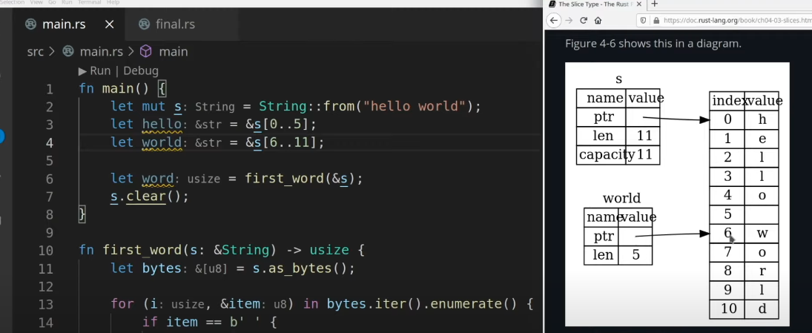

# Ownership

[⬅ Back](../README.md)

## Intro 
Video

<div>
  <a href="https://www.youtube.com/watch?v=VFIOSWy93H0"></a>
</div>
 
## Memory management 
- Garbage collection 
  
  Cons: We dont know when GC will clean up the mem, when it does, it slows down our app.

  GC is a piece of code, we have to include within our program 
  
  Ex: Swift, Java, C# 

- Manual memory management 
  
  Cons: take longer to write the code, security 
  
  Ex: C/C++

- Onwership
  
  Pros: Rust uses compiler checker to make thing safe

  Con: learning curve 

  Ex: Rust 

⭐️ Programming is about trade-off 



## Memory laid out 
- Stack

  fixed size, stack contains stackframe which is local functions in our program, stackframe stores local var of functions.

  Size of stackframe calculated at compile time. 
  When functions excuted, it popped out of stack with its var 

- Heap 
  
  dynamic size, if var is dynamic size, we use Heap to store it and get back the pointer to save in Stack

  Pushing to Stack is faster than allocate on Heap, same as accessing data.




## Onwership rules 
- Each value in Rust has a var that's called its owner 
- There can only be one owner at the time 
- when the owner goes out of scope, the var will be dropped

```Rust

{ // s is not valid here. it's not yet declared 
  let s: &str = "hello"; // s is valid from this point forward
  // do stuff with s
} // this scope is now over, s is no longer valid 

```

```Rust
let s: &str = "hello"; // can not changed 
let s: String = String::from("hello") // changeable 
```

## Moving 
```Rust
let x: i32 = 6;
let y: i32 = x; // copy

let s1: String = String::from("hello");
let s2: String = s1; // Move (not shallow copy) // AFTER move, s1 gone 
let s2: String = s1.clone() // s1 still alive 

println!("{}, world!", s1); // <-- error 

```

Moving is same pass as param to function 

```Rust
let s1: String = String::from("hello");
takes_ownership(s);
println!("{}", s); // <-- error

fun take_ownership(some_string: String) {
  println!("{}", some_string);
}

// int alsway copy
let x: i32 = 5;
makes_copy(x);
println!("{}", x);


fn makes_copy(some_integer: i32) {
  println!("{}", some_integer);
}

```

## Give ownership

```Rust

let s1: String = gives_ownership();
println!("s1 {}", s1);


fn gives_ownership() -> String {
  let some_string: String = String::from("Hello");
  some_string
}


let s2: String = String::from("hello");
let s3 = takes_and_gives_back(s2);

fn takes_and_gives_back(a_string: String) -> String {
  a_string
}

```

## Reference 
Moving the ownership and backout is tedious.

What if we just want to use a var without taking the ownership --> reference

### Problem 
```Rust
let s1: String = String::from("hello");
let (s2, len) = calculate_length(s1);
println!("The length of '{} is {}.", s2, len);

fn calculate_length(s: String) -> (String, usize) {
  let length = s.len();
  (s, length)
}

// fix add ampersand

let (s2, len) = calculate_length(&s1);

// below s is pointer, point to s1, and point to the string in the heap
fn calculate_length(s: &String) -> usize {
  let length = s.len();
  length
} // after this, we drop s, but s1 still ok 

```

<b>Borrowing </b> meaning passing reference to function params 

🟡 References are immutable 

Problem 
```Rust
let s1: String = String::from("hello");
change(&s1)

fn change(some_string: &String) {
  some_string.push_str("world"); // <--- err

// fix using mutable ref 
let mut s1: String = String::from("hello");
change(&mut s1)

fn change(some_string: &mut String) {
  some_string.push_str("world");
}

```

## Data race
One pointer tries to read the data at the middle of other pointer modifying the data --> Kabum 

You can borrow ONE mutable reference at a time


```Rust
let mut s1: String = String::from("hello");

let r1 = &mut s;
let r2 = &mut s; // <--  error 

```

🟡 You can NOT have a mutable ref when an Immuatable ref already exists coz Immutable don't expect underlying value to change 

Remember the scope of var b/w first introduce the var and the last using it 

```Rust
let mut s1: String = String::from("hello");

let r1 = &s;
let r2 = &s;
let r3 = &mut s; // <-- error 

println!("{} {}", r1, r2);

let r3 = &mut s;
println!("{}", r3) // ✅ ok coz r1, r2 out of scope and dropped 

```

## Dangling references 
What if our ref points to invalid data 


```Rust 
let reference_to_nothing = dangle();


fn dangle() -> &String {
  let s = String::from("hello");
  &s
} // dropped s 

```

## The rules of references 
- At any given time, you can have either one mutable reference of any number of immutable references 
- References must always be valid 


## Slices 
Let you reference to a small part of the collections not entirely  
ofc not take the ownership of data 

Problem: We want to return the first word of the string without taking its ownership --> use reference 

```Rust

let mut s = String::from("hello");
let word = first_word(&s);
s.clear(); // after this line, word still 5 --> 🔴 error prone we want to SYNC when s.clear --> word = 0 

// we will return the index of 1st word
fn first_word(s: &String) -> usize {
  let bytes = s.as_bytes();

  for (i, &item) in bytes.iter().enumerate() {
    if item == b' ' {
      return i;
    }
  }
  s.len()
}

// fix 
let mut s = String::from("hello");
let hello = &s[..5]
let world = &[6..]
let word = first_word(&s); // &s is called string ref auto coerce to string slices 
s.clear(); // causing error because world is immutable ref to a string. The rule cant not mix mutable and immuatable 
// let mut s just a define not relate to s (mutable) and word (immutable)

// &str syntax returns string sclices
fn first_word(s: &String) -> &str {
  let bytes = s.as_bytes();

  for (i, &item) in bytes.iter().enumerate() {
    if item == b' ' {
      return &s[..i];
    }
  }
  &s[..]
}


// fix ver 2 

let mut s = String::from("hello");
let s2 = "Hello world" // this is a string slices 
let word = first_word(s2);


// this input param is string slices also  
fn first_word(s: &str) -> &str {
  let bytes = s.as_bytes();

  for (i, &item) in bytes.iter().enumerate() {
    if item == b' ' {
      return &s[..i];
    }
  }
  &s[..]
}


```



```Rust


```


<p></p>

## Author

This repo was developed by [@lamha](https://github.com/HaLamUs). 
Follow or connect with me on [my LinkedIn](https://www.linkedin.com/in/lamhacs). 

## License