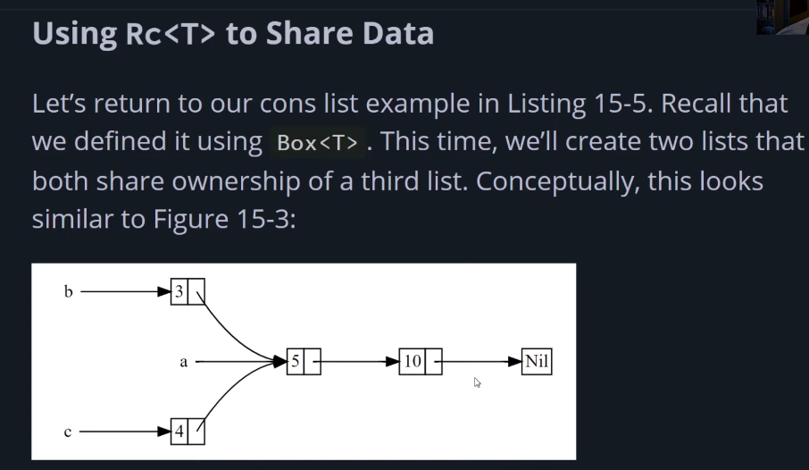

# Smart Pointers in Rust - Reference Counting

[⬅ Back](../README.md)

## Intro 
Video 

<div>
  <a href="https://www.youtube.com/watch?v=M9Owp3iLigg"></a>
</div>

## Reference counting 
RC allows us to share ownership of some data 

### Problem 
Most of the cases, ownership is clear, we know extractly which variable owns a specific value. But we have cases where a single value has multiple owners for example 

Graph with multiple edges that point to the same node conceptly that node is owned by all the edges 

## RC smart pointer 
RC SP which will keep track the number of references to a value and when there are no more references the value will get cleaned up 

An analogy: When you watching TV with some friends, you cant turn it off without having ppl watching it

Usecase when we want to allocate a value on the heap and have multip;le parts of our program read that value 
🔴 This only working in single thread programs 





```Rust
enum List {
  Cons(i32, Box<List>),
  Nil
}


fn main() {
  let a = Cons(5, Box::new(Cons(10, Box:new(Nil))));
  let b = Cons(3, Box::new(a));
  let c = Cons(4, Box::new(a)); // error cause b owns a now // a have been moved into b 
}

```


<p></p>

## Author

This repo was developed by [@lamha](https://github.com/HaLamUs). 
Follow or connect with me on [my LinkedIn](https://www.linkedin.com/in/lamhacs). 

## License
The source code for the site is licensed under the MIT license, [MIT](https://opensource.org/license/mit/)

 <a href="#top">Back to top</a>