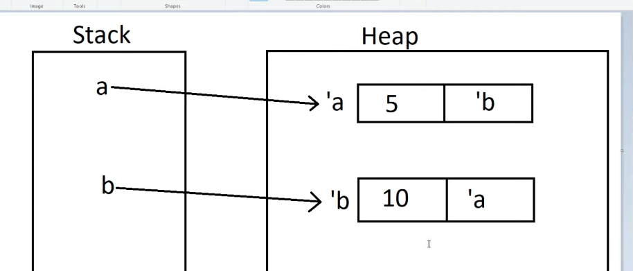
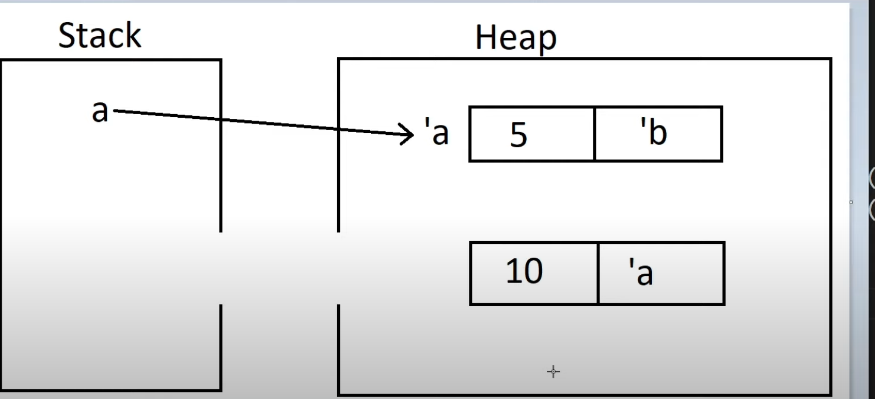
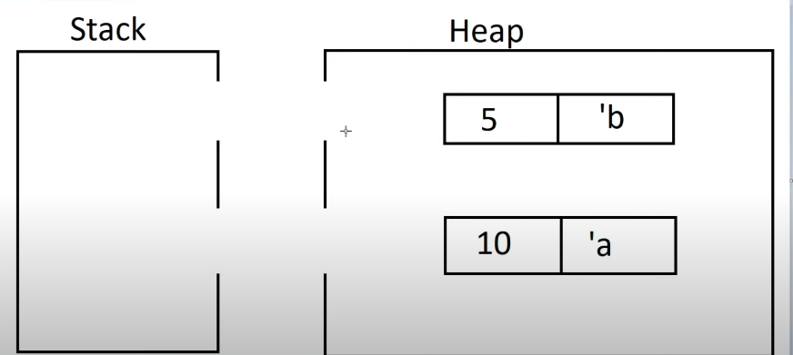

# Smart Pointers in Rust - Reference Cycles

[⬅ Back](../README.md)

## Intro 
Video 

<div>
  <a href="https://www.youtube.com/watch?v=pIVZRDFAUyc"></a>
</div>


## Memory leak 
Rust guarantee that you CANT have data races but memory leaks.

You can create a memory that is never cleaned up by rc smart pointer, reference counting sp, refcell sp.

Using these sp create references where item reference each other each other in a cycle which will create a memory leak 

## Example 

`Option<&RefCell<Rc<List>>>`

We use Rc because we want List have multiple owner.
We use RefCell because we want to be able to mutate the list 

## Reference cycles

First 


After


```Rust
  // Uncomment thex next line to see that we have a cycle
  // it will overflow the stack

  println!("a next item = {:?}", a.tail());
```

Because we println PRINTLN, a.tail = b, b.tail = a the infinite loop 

### Clean up 
The stack memory clean up but not the heap memory.
Because the heap vars still pointing each other. They got orphaned and wont cleaned up 

Step 1


Step 2



<p></p>


Creating Reference cycles is logical bug in your code 


## Author

This repo was developed by [@lamha](https://github.com/HaLamUs). 
Follow or connect with me on [my LinkedIn](https://www.linkedin.com/in/lamhacs). 

## License
The source code for the site is licensed under the MIT license, [MIT](https://opensource.org/license/mit/)

 <a href="#top">Back to top</a>