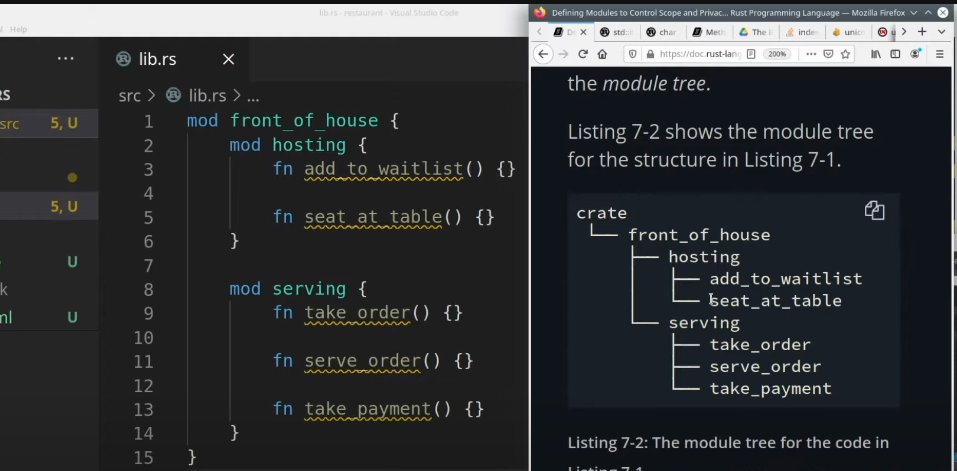

# Rust module

[⬅ Back](../README.md)

## Intro 
Video

<div>
  <a href="https://www.youtube.com/watch?v=5RPXgDQrjio"></a>
</div>


## Module 
The way we organize our project structure.

## Crate
A crate is a compilation unit in Rust. Whenever rustc `some_file.rs` is called, `some_file.rs` is treated as the crate file. 
https://doc.rust-lang.org/rust-by-example/crates.html

## Lib 

```Bash
cargo new --lib restaurant
```

`lib.rs` replaces by `main.rs`



Everything is private by default 

```Rust
mod front_of_house {
  mod hosting {
    fn add_to_waitlist() {}

    fn seat_at_table() {}
  }

}

pub fn eat_at_restaurant() {
  // absolute path 
  crate::front_of_house::hosting::add_to_waitlist();

  // relative path
  front_of_house::hosting::add_to_waitlist();   
}
```


<p></p>

## Author

This repo was developed by [@lamha](https://github.com/HaLamUs). 
Follow or connect with me on [my LinkedIn](https://www.linkedin.com/in/lamhacs). 

## License
The source code for the site is licensed under the MIT license, [MIT](https://opensource.org/license/mit/)

 <a href="#top">Back to top</a>
