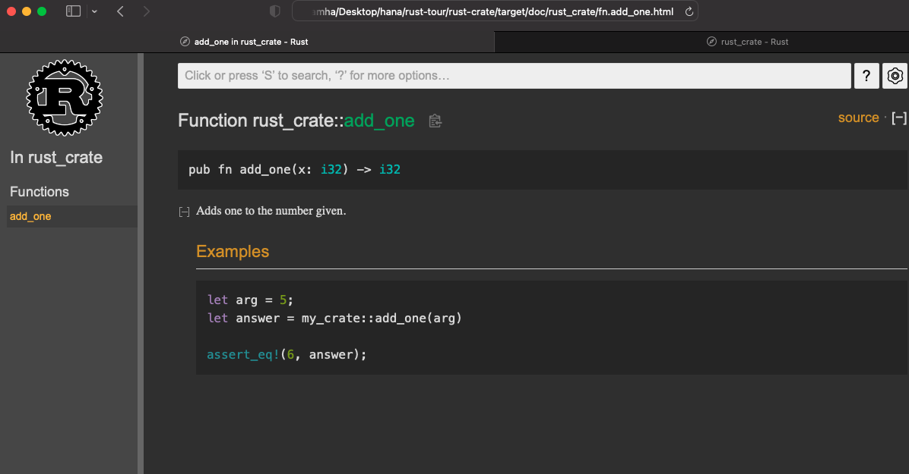
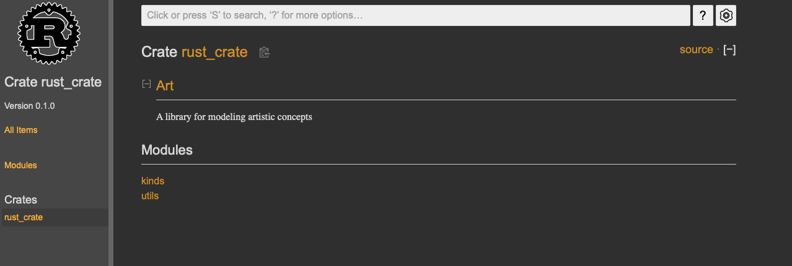
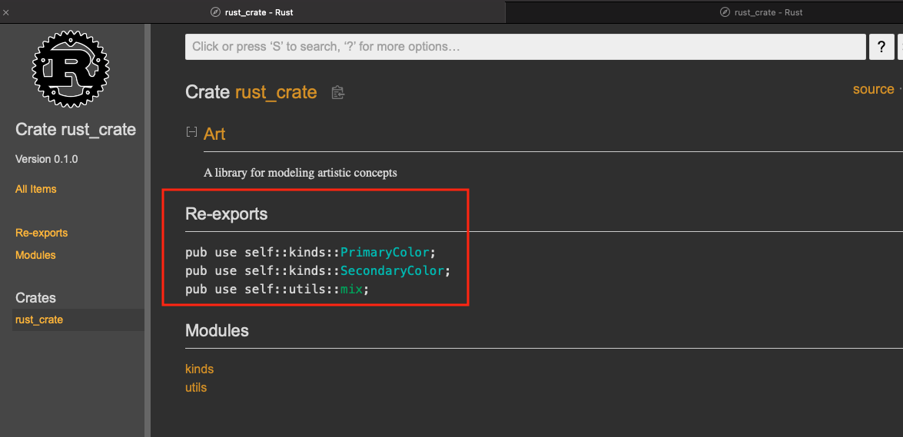

# Rust Crate

[⬅ Back](../../README.md)

## Intro 
Video 

<div>
  <a href="https://www.youtube.com/watch?v=4TI153PIEDQ"></a>
</div>

## Crate 
A crate is a compilation unit in Rust. Whenever rustc some_file.rs is called, some_file.rs is treated as the crate file

Upload your own code to crates.io 

## Profile 

```bash
// dev 
cargo build
```

```bash
// release
cargo build --release
```

### Cargo.toml

```bash
[profile.dev]
opt-level = 0

[profile.release]
opt-level = 3
```

The trade-off 

For dev, We will have a fast compile time a slower run time 

Release mode, slower compile time for a faster runtime 


## Documentation comments 

Normal starts with 2 slashes 

While DC starts with 3 slashes 

### Create documentation html

```bash
cargo doc --open
```



Rust runs test in documentation comment

```rust
/// Adds one to the number given.
///
/// # Examples
///
/// ```
/// let arg = 5;
/// let answer = rust_crate::add_one(arg);
///
/// assert_eq!(6, answer);
///```

pub fn add_one(x: i32) -> i32 {
  x + 1
}
```

## Other DC style

```Rust
//! # Rust crate
//!
//! `rust crate` is a collection of utilities to make performing certain
//! calculations more convenient.

/// Adds one to the number given.
///
/// #Example
///
///```
/// let arg = 5;
/// let answer = rust_crate::add_one(arg);
///
/// assert_eq!(6, answer);
///```

pub fn add_one(x: i32) -> i32 {
  x + 1
}

```

## Module 

```Rust
//! # Art 
//!
//! A library for modeling artistic concepts

pub mod kinds {
  /// The primary colors according to the RYB color model
  pub enum PrimaryColor {
    Red,
    Yellow,
    Blue,
  }

  /// The secondary colors according to the RYB color model

  pub enum SecondaryColor {
    Orange,
    Green,
    Purple,
  }
}
```


🔴 The module name is in `Cargo.toml` where 

```
[package]
name = "rust-crate"
```

With this define users have to jump to each modules (`kinds, utils`) to understand what are going on.



### Fix 

Define on top of it

```Rust
pub use self::kinds::PrimaryColor;
pub use self::kinds::SecondaryColor;
pub use self::utils::mix;

pub mod kinds {
  /// The primary colors according to the RYB color model
  pub enum PrimaryColor {
    Red,
    Yellow,
    Blue,
  }
```

```Rust
// main.rs
// Before

use art::kinds::PrimaryColor;
use art::utils::mix;

// after 

use art::PrimaryColor;
use art::mix;

```



## crate.io

https://crates.io/

```bash
cargo login secret_key
cargo publish
```

Check `cargo.toml` makes sure the name is unique and below

```bash
description = "A hello world library"
license = "MIT"

```

## update

Change version 

```bash
version = "1.0.0"

cargo publish
```


## TIL 

```Bash
git commit -am 'text'

git add .
git commit -m 'text'

```


<p></p>

## Author

This repo was developed by [@lamha](https://github.com/HaLamUs). 
Follow or connect with me on [my LinkedIn](https://www.linkedin.com/in/lamhacs). 

## License
The source code for the site is licensed under the MIT license, [MIT](https://opensource.org/license/mit/)

 <a href="#top">Back to top</a>