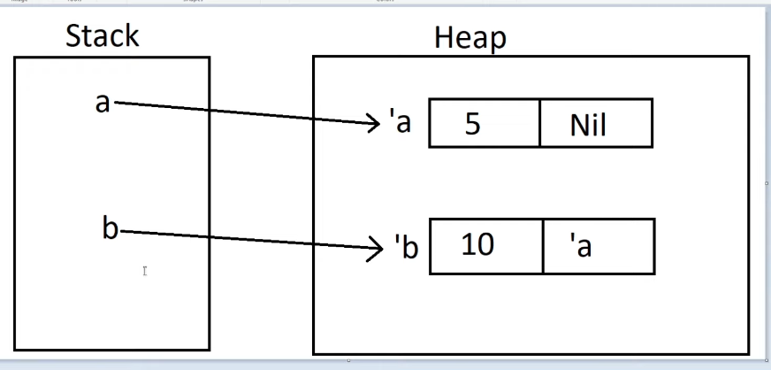
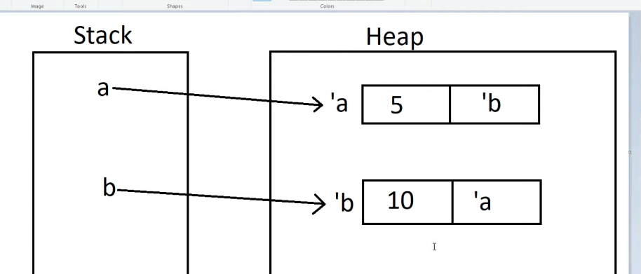
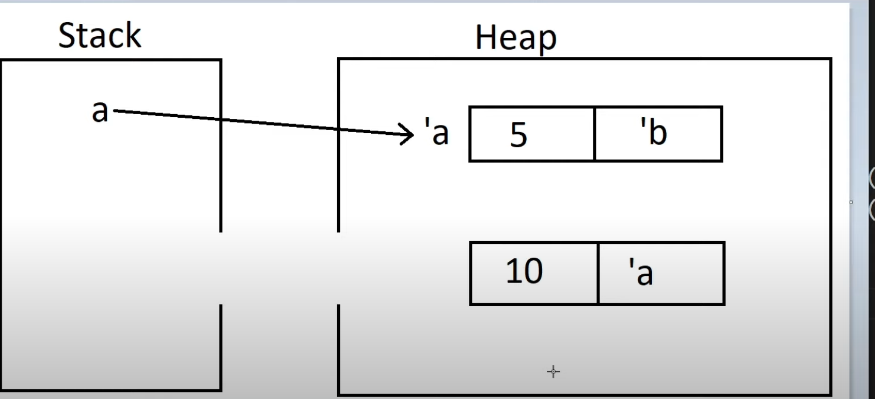
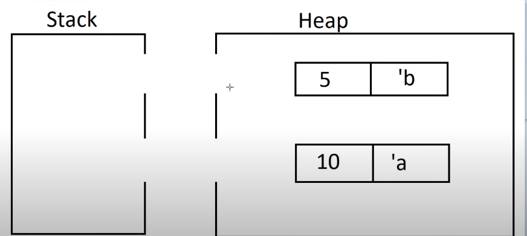

# Smart Pointers in Rust - Reference Cycles

[⬅ Back](../../README.md)

## Intro 
Video 

<div>
  <a href="https://www.youtube.com/watch?v=pIVZRDFAUyc"></a>
</div>


## Memory leak 
Rust guarantee that you CANT have data races but memory leaks.

You can create a memory that is never cleaned up by rc smart pointer, reference counting sp, refcell sp.

Using these sp create references where item reference each other each other in a cycle which will create a memory leak 

## Example 

`Option<&RefCell<Rc<List>>>`

We use Rc because we want List have multiple owner.
We use RefCell because we want to be able to mutate the list 

## Reference cycles

First 


After


```Rust
  // Uncomment thex next line to see that we have a cycle
  // it will overflow the stack

  println!("a next item = {:?}", a.tail());
```

Because we println PRINTLN, a.tail = b, b.tail = a the infinite loop 

### Clean up 
The stack memory clean up but not the heap memory.
Because the heap vars still pointing each other. They got orphaned and wont cleaned up 

Step 1


Step 2



<p></p>


Creating Reference cycles is logical bug in your code 


```Rust
enum List {
  Cons(i32, RefCell<Rc<List>>),
  Nil,
}

impl List {
  fn tail(&self) -> Option<&RefCell<Rc<List>>> {
    match self {
      Cons(_, item) => Some(item),
      Nil => None,
    }
  }
}

fn main() {
  let a = Rc::new(Cons(5, RefCell::new(Rc::new(Nil))));

  println!("a initial rc count = {}", Rc::strong_count(&a));
  println!("a next item {:?}", a.tail());

  let b = Rc::new(Cons(10, RefCell::new(Rc::clone(&a))));

  println!("a rc count after b creation = {}", Rc::strong_count(&a)); // 2
  println!("b initial rc count = {}", Rc::strong_count(&b)); // 1
  println!("b next item {:?}", b.tail()); // a 

  if let Some(link) = a.tail() { // Link is nill
    *link.borrow_mut() = Rc::clone(&b)
  }

  println!("b rc count after changing a = {}", Rc::strong_count(&b));
  println!("a rc count after changing a = {}", Rc::strong_count(&a));

  // Uncomment thex next line to see that we have a cycle
  // it will overflow the stack

  println!("a next item = {:?}", a.tail());

}

```


## Fix 

```Rust
parent:  RefCell<Rc<Node>>, // create reference cycle 
parent:  RefCell<Weak<Node>>, // because parent drop, children drop either - 1 way 

```

```Rust
*leaf.parent.borrow_mut() = Rc::downgrade(&branch);

println!("leaf parent = {:?}", leaf.parent.borrow().upgrade());
```

`downgrade` to change reference counting sp to weak sp

`upgrade` convert weak sp to rc sp 
Because weak sp has no idea, the value droped or not 

## Weak smart pointer 
Weak sp is a version of the reference counting sp that holds a non-owning reference

## Rc sp

RC sp stores 2 counts
  - strong_count: number of ref which have ownership of the data 
  - weak_count: number of ref which doesn't have ownership of the data


## Author

This repo was developed by [@lamha](https://github.com/HaLamUs). 
Follow or connect with me on [my LinkedIn](https://www.linkedin.com/in/lamhacs). 

## License
The source code for the site is licensed under the MIT license, [MIT](https://opensource.org/license/mit/)

 <a href="#top">Back to top</a>