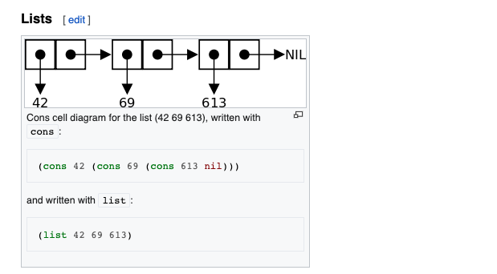

# The Box Smart Pointer in Rust

[⬅ Back](../../README.md)

## Intro 
Video 

<div>
  <a href="https://www.youtube.com/watch?v=m76sRj2VgGo"></a>
</div>

## Pointer 
Pointer is a variable that stores a memory address and that memory address refers to or points to some other data in memory 

Reference is the most common pointer in Rust.

Reference simply borrow the values they point to which means they don't have ownership over the value 

## Smart pointer 
SP has more capabilities, SPs are data structures that act like a pointer but have metadata and extra capabilities 

They have reference counting which keeps tracking the number of owners and cleaning up when there is no owners. Sometime it owns the data NOT just borrow. 

Example: String, Vector 

They own data and allow you to manipulate it. They store extra metadata such as capacity and extra capabilities for example `String` ensures that the data is valid utf-8 

In detail, SP is implemented by struct and traits 


## Box 
Box is SP that allows you allocate values on heap 

```Rust
fn main() {
  let b = Box::new(5);
  println("b = {}", b);
}
```

`Box::new(5);` we use `new` fn to store `5` on the heap and on the stack we are storing a pointer or a memory address to the location of `5` 

`println("b = {}", b);` defaults will be print the value that `b` is pointing

Box pointer's Use cases: 

1. a Large amount of data, we dont want to copy it, we just need to transfer the data ownership. 
Large so stored in heap

2. a type whose exact size CANT be known at compile time but we want to the value of that type 


Unknow size it's maybe large or smalle, so stored in heap 


🟡 Stack is accessed faster than heap but it is limited 


## Recursive enum 

```Rust
enum List {
  Cons(i32, List),
  Nil,
}

```

Rust cant know how much space this type takes up at compile time.

Extra: `Cons` is a list 
https://en.wikipedia.org/wiki/Cons



Because the Cons is infinite size. Instead of storing the list directly we should store a pointer to the list value 


Check the syntax
```bash
cargo check 
```

## Calculate size 

```Rust
enum Message {
  Quit,
  Move {x: i32, y: i32},
  Write(String),
  ChangeColor(i32, i32, i32),
}

```

enum can only use one variant at a time.
So it will take the most space of largest variant 

Rust can calcualte the size of known type and pointer ofc 

This can calculate. Pointer is fixed size 

```Rust
enum List {
  Cons(i32, Box<List>),
  Nil,
}
```


<p></p>

## Author

This repo was developed by [@lamha](https://github.com/HaLamUs). 
Follow or connect with me on [my LinkedIn](https://www.linkedin.com/in/lamhacs). 

## License
The source code for the site is licensed under the MIT license, [MIT](https://opensource.org/license/mit/)

 <a href="#top">Back to top</a>